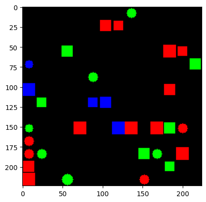
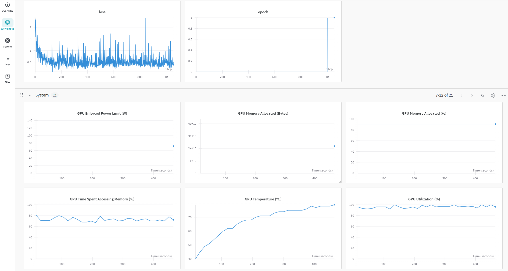

# VLM finetune experiment

This repo is based on mini-gpt4 and mini-gpt4-v2.

Goal: setup a mock dataset based on simulation and study how well VLMs solve various vision tasks.

## Environment Setup

Install required pip packages (some of them are version sensitive)
```
pip install -r requirements.txt
```

Download model weights
```
cd models
gdown 1HkoUUrjzFGn33cSiUkI-KcT-zysCynAz
git clone https://<username>:<token>@huggingface.co/meta-llama/Llama-2-7b-chat-hf
```

(Already done in this repo) edit config files
```
eval_configs/minigptv2_eval.yaml
minigpt4/configs/models/minigpt_v2.yaml
```

Run demo example
```
python demo_v2.py --cfg-path eval_configs/minigptv2_eval.yaml  --gpu-id 0
```

## Synthetic Dataset

Randomly draw circles and square (with random color and size) on canvas and ask the model to perform a series of tasks:

- Counting: how many red squares?
- Spatial reasoning: what is on the left of the green circle?

These are abilities that previous generation of models seem to be struggling with.



## Run Finetune Experiment

Depending on your available number of GPUs, you can scale-up the training and adjust batch size
```
torchrun --nproc-per-node 1 train.py --cfg-path train_configs/minigptv2_finetune.yaml
```

Example: https://wandb.ai/jiahang-li/minigptv/runs/kjt2tn7q?nw=nwuserjiahang_li


